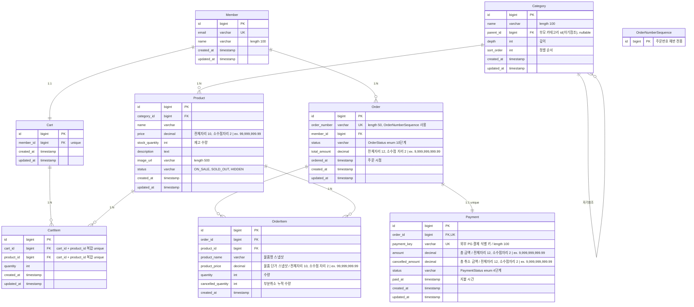
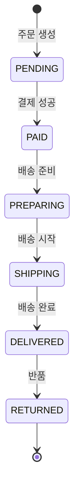
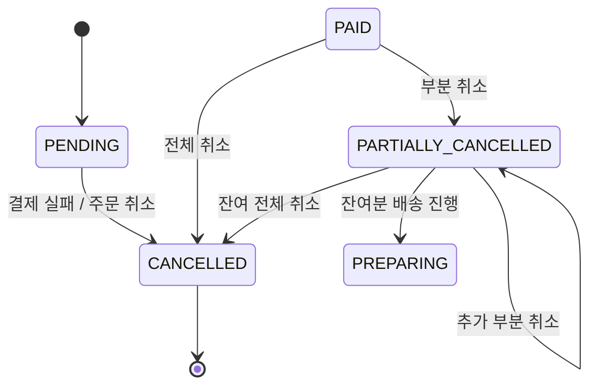
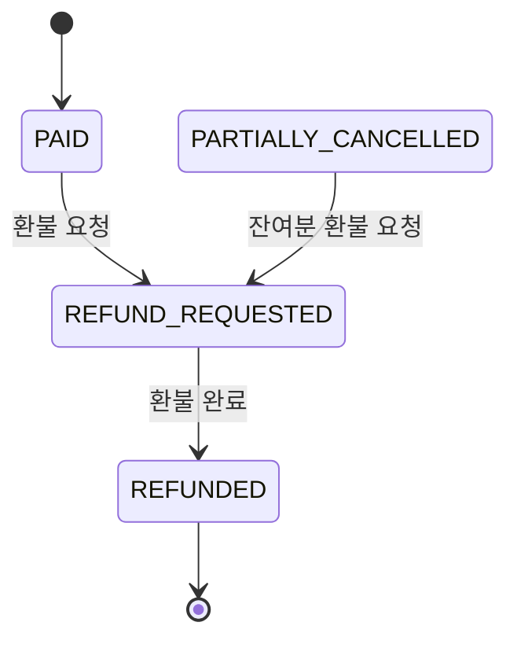
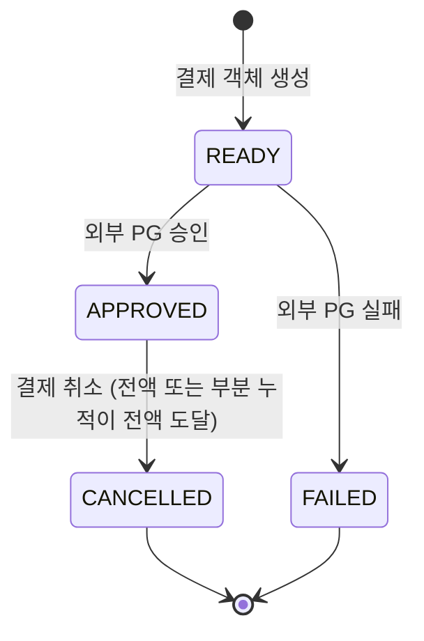

# 주문 시스템 ERD

## 1. ERD



---

## 2. 엔티티별 참고 사항

### Member (회원)
- `email` unique 제약
- `name` 길이 100자 제한

### Category (카테고리)
- 자기참조 구조 (`parent_id`)
- `depth`, `sort_order`로 계층 트리 표현
```shell
  category 테이블
  ┌────┬────────┬───────────┐
  │ id │ name   │ parent_id │
  ├────┼────────┼───────────┤
  │ 1  │ 전자제품 │ NULL      │ ← 최상위
  │ 6  │ 스마트폰 │ 1         │ ← 부모는 id=1 (전자제품)
  │ 7  │ 노트북  │ 1         │ ← 부모는 id=1 (전자제품)
  └────┴────────┴───────────┘
```
- 비즈니스 로직
    - 부모 → 자식 LAZY 로딩
    - 정렬기준: `@OrderBy("sortOrder ASC")`

### Product (상품)
- 비즈니스 로직
    - `findByIdWithLock` 으로 락 획득
    - `deductStock()`, `restoreStock()` 메서드로 재고 변경
    - 상태(`status`): `ProductStatus` enum (예: `ON_SALE`)

### Cart (장바구니)
- 비즈니스 로직
    - `cascade = ALL`, `orphanRemoval = true` → 회원 삭제 시 같이 삭제

### CartItem (장바구니상품)
- `(cart_id, product_id)` 복합 unique 제약 → 같은 상품 중복 담기 불가
- 수량만 증가 (`addQuantity`, `updateQuantity`)

### Order (주문)
- `ordered_at` 으로 주문 시점 기록
- 상태 전이: **10단계 enum**, 3개 흐름으로 분리 (아래 상태 전이도 참고)
    - **정상 배송**: PENDING → PAID → PREPARING → SHIPPING → DELIVERED → RETURNED
    - **취소**: PENDING/PAID → CANCELLED, PAID ⇄ PARTIALLY_CANCELLED
    - **환불**: PAID/PARTIALLY_CANCELLED → REFUND_REQUESTED → REFUNDED
- 비즈니스 로직
    - 취소 시 비관적 락 (`findByIdForUpdate`)
    - 상태 전이 검증 (`validateTransitionTo`) — 허용되지 않은 전이 시 `BusinessException`

### OrderItem (주문상품)
- **스냅샷 컬럼**: `product_name`, `product_price`
    - 주문 시점 가격을 그대로 저장 → 추후 상품 가격 변경 영향 없음
- `cancelled_quantity`: 부분 취소 누적 추적
- `created_at` : `BaseTimeEntity` 상속하지 않음 (`@CreatedDate` 직접 사용)
- 비즈니스 로직
    - `getActiveQuantity()` = `quantity - cancelled_quantity`

### Payment (결제)
- 상태 전이: `READY → APPROVED → CANCELLED/FAILED`
- `cancelled_amount`: 부분 취소 누적 금액
- `partialCancel()` 메서드로 부분 취소 시 누적

### OrderNumberSequence (주문번호시퀀스)
- 주문번호 채번 전용 테이블

---

## 3. 상태 전이도

### 3-1) 주문 상태 (OrderStatus)

OrderStatus enum은 총 **10단계**로 구성되며, 흐름별로 3개로 나누어 표현

#### ① 정상 배송 흐름



#### ② 취소 흐름



#### ③ 환불 흐름



---

### 3-2) 결제 상태 (PaymentStatus)



> `partialCancel()` 호출 시에는 `cancelled_amount` 만 누적되고 status는 APPROVED 유지.
> 
> 누적 취소 금액이 전체 금액(`amount`)과 같아지면 CANCELLED 로 전이.
