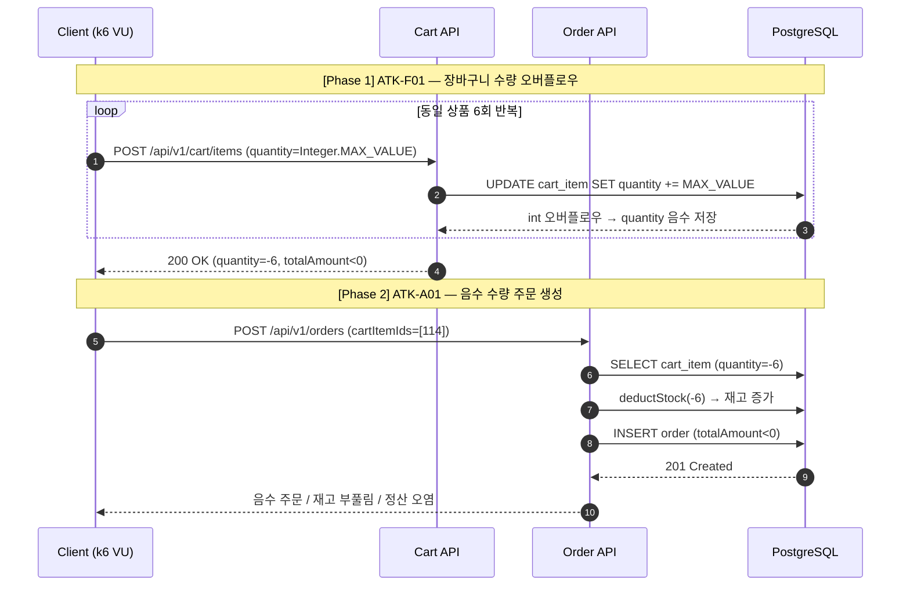

# 부하테스트 리포트

---

## 1. 시나리오 상세

| ID | 시나리오명 | 키워드 | 엔드포인트 | 목표 가설 | 가설 근거(코드) | 트래픽/패턴 | 예상 문제점 | 기술적 근거 |
|----|-----------|--------|-----------|----------|----------------|------------|------------|-------------|
| **ATK-F01** | 장바구니 수량 정수 오버플로우 | `입력검증누락` `오버플로우` `정합성` | `POST /api/v1/cart/items` | `quantity` 상한이 없어 `Integer.MAX_VALUE`를 반복 입력할 수 있고, 같은 상품 수량 누적 중 `int` 범위를 넘으면 음수 수량이 저장된다. | `AddCartItemRequest.quantity`는 `@Min(1)`만 있고 `@Max` 없음<br>`CartItem.addQuantity()`가 `this.quantity += quantity`로 단순 누적<br>`CartService.addItem()`이 누적 결과를 그대로 저장·응답 | 동일 사용자, 동일 상품 반복 추가 / Single user, 6회 | 장바구니 수량·총액 음수화, 후속 주문으로 취약점 전파 | 실측: `quantity=2147483647` 반복 추가 후 `cartItemId=114`, `quantity=-6`<br>`GET /cart` 기준 `totalAmount=-213499.74` |
| **ATK-A01** | 음수 수량 주문 생성 및 재고 부풀리기 | `입력검증누락` `정합성` `재고조작` `오버플로우` | `POST /api/v1/orders` | 장바구니에 음수 수량이 저장된 상태에서 주문 API가 수량을 재검증하지 않으면 음수 금액 주문이 생성되고, 재고 차감 로직은 오히려 재고를 증가시킨다. | `CreateOrderRequest`는 `cartItemIds`만 검증<br>`OrderService.createOrder()`가 `cartItem.getQuantity()`를 그대로 재고 차감·금액 계산에 사용<br>`Product.deductStock()`에 `quantity <= 0` 방어 없음 | ATK-F01 결과 사용 / Single user, 1회 | 음수 주문 생성, 상품 재고 임의 증가, 결제·정산 데이터 오염 | 실측: `cartItemId=114`, `quantity=-6`으로 주문 생성 시 `201 Created`<br>`totalAmount=-287104.20`, `status=PENDING`<br>상품 재고 `279 → 285` |

---

## 2. 시퀀스 다이어그램 *(참고 예시 — 직접 다듬어 작성)*



---

## 3. 레이어별 분석

### 3-1. 애플리케이션

- **트랜잭션 범위**:
- **외부 의존성 영향**:
- **예외 처리 / 재시도 로직**:
- **코드 개선 포인트**:
- 추가 발견 이슈:

### 3-2. DB

- **락 경합 / 데드락**:
- **인덱스 / 쿼리 효율**:
- **커넥션 사용 패턴**:
- **데이터 정합성**:
- 추가 발견 이슈:

### 3-3. 인프라 & RabbitMQ

- **CPU / Memory / Disk I/O**:
- **네트워크 / 커넥션 풀**:
- **RabbitMQ** (해당 시):
- **인프라 개선 포인트**:
- 추가 발견 이슈:

---

## 4. 테스트 설계

**더미 데이터 요청**: 종류 / 수량 / 특이 조건

*(예: 단일 사용자 1명, 단일 상품 1개, F01 결과를 A01이 그대로 사용하므로 cart 상태 공유 필수)*

```javascript
// k6 스크립트 — F01 → A01 순차 실행
import http from 'k6/http';
import { check, sleep } from 'k6';

export const options = {
    scenarios: {
        // TODO: ATK-F01 — 동일 사용자/상품 quantity=Integer.MAX_VALUE 6회 반복
        // TODO: ATK-A01 — F01 종료 후 음수 quantity cartItem으로 주문 1회
    },
};

export default function () {
    // TODO: POST /api/v1/cart/items / POST /api/v1/orders 호출
}
```

---

## 5. 실행 결과 *(공격 당일 작성)*

| 시나리오 | TPS | p95 | 에러율 | 비고 |
|---------|-----|-----|------|------|
| ATK-F01 |     |     |       |      |
| ATK-A01 |     |     |       |      |

**Grafana 스크린샷**: TPS / 응답시간 / 에러율 / 자원사용량 (필요한 것만 첨부)

**예상 문제점 적중 여부**

- ATK-F01:
- ATK-A01:

---

## 6. 종합 결론 & 방어팀 전달 *(공격 당일 작성)*

- **가설 적중**: ✅ / ❌ + 핵심 실측 한 줄
- **방어팀 전달**:
