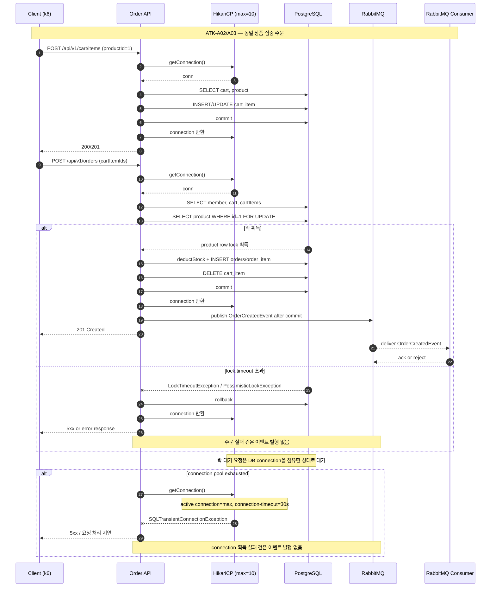

# 부하테스트 리포트
  
---  

## 1. 시나리오 상세

| ID          | 시나리오명                 | 키워드            | 엔드포인트                 | 목표 가설                                                                               | 가설 근거(코드)                                                                                                            | 트래픽/패턴                                                                               | 예상 문제점                                                                     | 기술적 근거                                                                                                     |
| ----------- | --------------------- | -------------- | --------------------- | ----------------------------------------------------------------------------------- | -------------------------------------------------------------------------------------------------------------------- | ------------------------------------------------------------------------------------ | -------------------------------------------------------------------------- | ---------------------------------------------------------------------------------------------------------- |
| **ATK-A02** | 동일 상품 집중 주문 락 경합      | `락경합` `핫로우`    | `POST /api/v1/orders` | 동일 상품에 주문이 집중되면 `PESSIMISTIC_WRITE` 락 대기로 요청이 직렬화되고 일부 요청이 lock timeout으로 실패할 수 있다. | `OrderService.createOrder()`에서 `productRepository.findByIdWithLock()` 호출<br>`jakarta.persistence.lock.timeout: 3000` | 동일 `productId` 대상 Baseline 50 → Target 150 → Stress 300 → Spike 500 RPS, Stepped 10분 | 응답 지연 증가, 일부 주문 `LockTimeoutException` 또는 `PessimisticLockException` 실패 가능 | 상품 행 `SELECT ... FOR UPDATE` 경합으로 후행 트랜잭션 대기. 3초 초과 시 lock timeout. 단일 row 처리량은 트랜잭션 길이에 의해 제한됨            |
| **ATK-A03** | 락 대기 누적으로 인한 커넥션 풀 고갈 | `리소스소진` `커넥션풀` | `POST /api/v1/orders` | 락 대기가 길어지면 대기 중 요청이 DB 커넥션을 점유해 HikariCP 풀 고갈로 확산될 수 있다.                            | `createOrder()` 전체 `@Transactional` 적용<br>HikariCP `maximum-pool-size: 10`, `connection-timeout: 30000`              | 동일 상품 대상 500 RPS Spike 지속 / ATK-A02 이후 락 대기 누적 관찰                                    | 커넥션 획득 대기 증가, 일부 요청 `SQLTransientConnectionException`, Tomcat thread 점유 가능 | 락 대기 중 커넥션 반환 불가로 active connection이 증가한다. 단, lock timeout 3초로 커넥션이 빠르게 반환되면 pool exhaustion은 재현되지 않을 수 있음 |
  
---  

## 2. 시퀀스 다이어그램


  
---  

## 3. 레이어별 분석

### 3-1. 애플리케이션

- **트랜잭션 범위**:
- **외부 의존성 영향**:
- **예외 처리 / 재시도 로직**:
- **코드 개선 포인트**:
- 추가 발견 이슈:

### 3-2. DB

- **락 경합 / 데드락**:
- **인덱스 / 쿼리 효율**:
- **커넥션 사용 패턴**:
- **데이터 정합성**:
- 추가 발견 이슈:

### 3-3. 인프라 & RabbitMQ

- **CPU / Memory / Disk I/O**:
    - Disk I/O: LockTimeoutException, SQLTransientConnectionException 대량 발생 시 에러 로그 폭증으로 급증 예상
    - Memory: Lock/Connection 대기로 스레드가 쌓이면서 Tomcat 쓰레드 풀도 점유로 인한 스택 메모리 누적 예상
- **네트워크 / 커넥션 풀**:
    - 락 대기 요청이 DB 커넥션을 점유하면 HikariCP active connection이 증가하고, 고갈 시 신규 요청은 connection-timeout까지 대기 후 실패 가능
    - HTTP 요청 자체를 못 받는다기보다 Tomcat worker thread가 DB connection 획득/락 대기에서 점유되어 신규 요청 처리 지연으로 확산될 수 있음
- **RabbitMQ** (해당 시):
    - 정상 처리된 주문만 RabbitMQ로 이벤트 발행
    - 락 경합 또는 커넥션 풀 고갈로 주문 생성이 실패하면 해당 요청은 이벤트를 발행하지 않음
    - 장애 구간의 RabbitMQ publish 처리량은 주문 성공률에 비례해 감소할 것으로 예상
- **인프라 개선 포인트**:
    - HikariCP 모니터링 알림 필요
    - 커넥션 풀 수량 증가는 단독 처방보다 락 구간 단축, 요청 제한, 타임아웃 튜닝과 함께 검토 필요
    - Tomcat 쓰레드풀도 모니터링 필요
- 추가 발견 이슈:
    - 주문 API는 정상 응답했지만 ORDER_CREATED 이벤트 consumer에서 SimulatedDownstreamException 로그가 발생
    - API 성공률과 별개로 RabbitMQ consumer 실패율, queue depth, retry/requeue, DLQ 적재량을 별도 모니터링 필요

---  

## 4. 테스트 설계

```javascript
import http from 'k6/http';  
import { check } from 'k6';  
import { Counter, Trend } from 'k6/metrics';  
import exec from 'k6/execution';  
  
const BASE_URL = __ENV.BASE_URL || 'http://localhost:8080';  
const MEMBER_START = parseInt(__ENV.MEMBER_START || '1');  
const MEMBER_COUNT = parseInt(__ENV.MEMBER_COUNT || '5000');  
const PRODUCT_ID = parseInt(__ENV.PRODUCT_ID || '1');  
const DURATION = __ENV.DURATION || 'short'; // short=1m / long=10m  
  
// 커스텀 메트릭 — Grafana에서 락/커넥션 장애 구분용  
const lockTimeouts = new Counter('lock_timeout_errors');  
const connTimeouts = new Counter('conn_timeout_errors');  
const cartFailures = new Counter('cart_failures');  
const orderSuccess = new Counter('order_success');  
const orderFailures = new Counter('order_failures');  
const orderDuration = new Trend('order_duration');  
  
// 테스트 규모 설정  
// 부하 제약: Baseline 50 → Target 150 → Stress 300 → Spike 500 RPS  
// ramping-arrival-rate는 VU 수가 아니라 초당 iteration 도착률을 제어한다.  
// iteration 1회 = 장바구니 추가 1회 + 주문 생성 1회이며, 주문 요청 기준 목표 RPS로 해석한다.  
const stages = DURATION === 'long'  
    ? [  // 본번: 총 10분  
        { duration: '2m', target: 50 },    // Baseline: 평균 이상 정상 부하  
        { duration: '2m', target: 150 },   // Target: 최대 피크  
        { duration: '2m', target: 300 },   // Stress: 피크 2배  
        { duration: '2m', target: 500 },   // Spike: 급격한 과부하  
        { duration: '2m', target: 0 },     // 쿨다운  
    ]  
    : [  // 테스트: 총 1분  
        { duration: '10s', target: 50 },   // Baseline  
        { duration: '10s', target: 150 },  // Target  
        { duration: '15s', target: 300 },  // Stress  
        { duration: '15s', target: 500 },  // Spike  
        { duration: '10s', target: 0 },    // 쿨다운  
    ];  
  
export const options = {  
    scenarios: {  
        order_stress: {  
            executor: 'ramping-arrival-rate',  
            startRate: 0,  
            timeUnit: '1s',  
            preAllocatedVUs: 200,  
            maxVUs: 1000,  
            stages: stages,  
        },  
    },  
    thresholds: {  
        order_duration: ['p(95)<300', 'p(99)<500'],  
    },  
};  
  
export default function () {  
    const memberId = MEMBER_START + (exec.scenario.iterationInTest % MEMBER_COUNT);  
  
    const headers = {  
        'Content-Type': 'application/json',  
        'X-Member-Id': String(memberId),  
    };  
  
    // Step 1: 장바구니에 상품 추가 (주문 후 cart_item 삭제되므로 매반 보충)  
    const cartRes = http.post(  
        `${BASE_URL}/api/v1/cart/items`,  
        JSON.stringify({ productId: PRODUCT_ID, quantity: 1 }),  
        { headers }  
    );  
  
    if (cartRes.status !== 200 && cartRes.status !== 201) {  
        cartFailures.add(1);  
        return; // 장바구니 추가 실패 시 skip  
    }  
  
    let cartItemId;  
    try {  
        cartItemId = JSON.parse(cartRes.body).cartItemId;  
    } catch (e) {  
        cartFailures.add(1);  
        return;  
    }  
  
    if (!cartItemId) {  
        cartFailures.add(1);  
        return;  
    }  
  
    // Step 2: 주문 생성 (동일 product row 락 경합 발생 지점)  
    const payload = JSON.stringify({  
        cartItemIds: [cartItemId],  
    });  
  
    const start = Date.now();  
    const res = http.post(  
        `${BASE_URL}/api/v1/orders`, payload, { headers, timeout: '60s' }  
    );  
    const elapsed = Date.now() - start;  
    orderDuration.add(elapsed);  
  
    // 응답별 분류  
    if (res.status === 201) {  
        orderSuccess.add(1);  
    } else {  
        orderFailures.add(1);  
  
        const body = (res.body || '').toLowerCase();  
        if (body.includes('lock') || body.includes('pessimistic') || body.includes('timeout')) {  
            lockTimeouts.add(1);  // A02: LockTimeoutException / PessimisticLockException  
        }  
        if (body.includes('connection') || body.includes('hikari') || body.includes('sqltransientconnection')) {  
            connTimeouts.add(1);  // A03: SQLTransientConnectionException / Hikari connection timeout  
        }  
    }  
  
    check(res, {  
        '응답 수신': (r) => r.status !== 0,  
        '주문 성공 (201)': (r) => r.status === 201,  
    });  
}
```
 
---  

## 5. 실행 결과 *(공격 당일 작성)*

| 시나리오    | TPS(초당 트랜잭션 요청 수) | p95<br>(요청의 95% 처리시간) | 에러율<br>(실패 요청수/전체 요청 수) | 비고  |     |
| ------- | ----------------- | --------------------- | ----------------------- | --- | --- |
| ATK-A02 |                   |                       |                         |     |     |
| ATK-A03 |                   |                       |                         |     |     |

**Grafana 스크린샷**: TPS / 응답시간 / 에러율 / 자원사용량 (필요한 것만 첨부)

**예상 문제점 적중 여부**

- ATK-A02:
- ATK-A03:

---  

## 6. 종합 결론 & 방어팀 전달 *(공격 당일 작성)*

- **가설 적중**: ✅ / ❌ + 핵심 실측 한 줄
- **방어팀 전달**:
