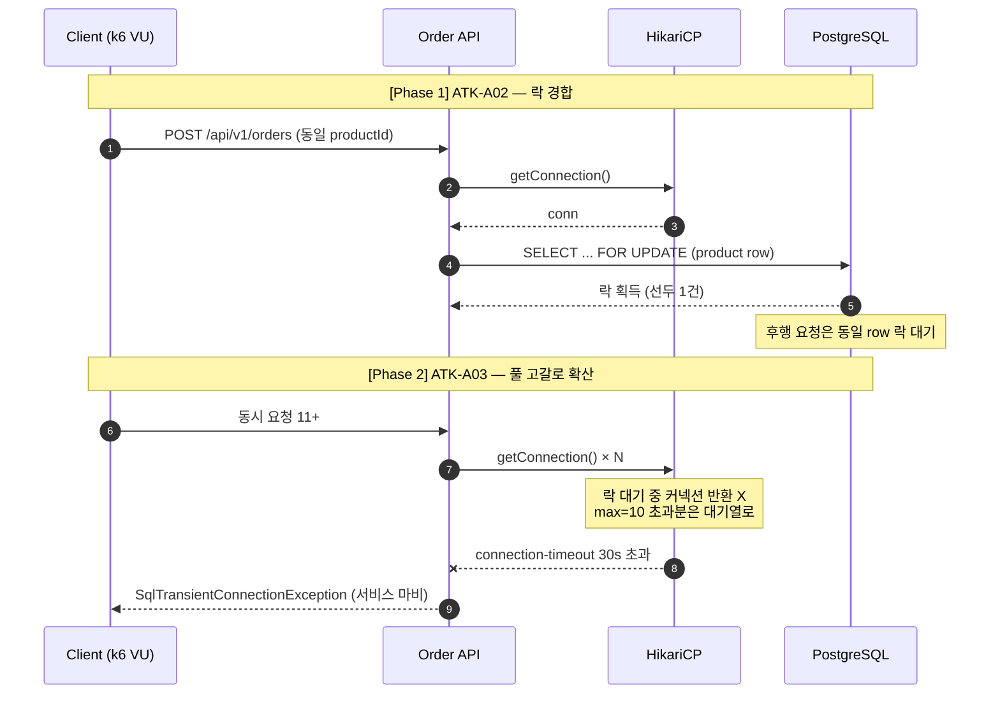

# 부하테스트 리포트

---

## 1. 시나리오 상세

| ID          | 시나리오명                 | 키워드            | 엔드포인트                 | 목표 가설                                                                               | 가설 근거(코드)                                                                                                               | 트래픽/패턴                                                      | 예상 문제점                                                      | 기술적 근거                                                                                                                  |
|-------------|-----------------------|----------------|-----------------------|-------------------------------------------------------------------------------------|-------------------------------------------------------------------------------------------------------------------------|-------------------------------------------------------------|-------------------------------------------------------------|-------------------------------------------------------------------------------------------------------------------------|
| **ATK-A02** | 동일 상품 집중 주문 락 경합      | `락경합` `핫로우`    | `POST /api/v1/orders` | 동일 상품에 주문이 집중되면 `PESSIMISTIC_WRITE` 락 대기로 요청이 직렬화되고 일부 요청이 lock timeout으로 실패할 수 있다. | `OrderService.createOrder()`에서 `productRepository.findByIdWithLock()` 반복 호출<br>`jakarta.persistence.lock.timeout: 3000` | 동일 `productId` 대상 Spike / 100 → 500 → 1,000 VU, Stepped 10분 | 응답 지연 증가, 일부 주문 `LockTimeoutException` 실패                   | 상품 행 `SELECT ... FOR UPDATE` 경합으로 후행 트랜잭션 대기. 3초 초과 시 lock timeout. 이론 TPS = `1,000ms / 트랜잭션 길이` 로 단일 row 처리량은 한 자릿수 수준 |
| **ATK-A03** | 락 대기 누적으로 인한 커넥션 풀 고갈 | `리소스소진` `커넥션풀` | `POST /api/v1/orders` | 락 대기가 길어지면 대기 중 요청이 DB 커넥션을 점유해 HikariCP 풀 고갈로 확산될 수 있다.                            | `createOrder()` 전체 `@Transactional` 적용<br>HikariCP `maximum-pool-size: 10`, `connection-timeout: 30000`                 | 동일 상품 대상 10개 초과 동시 요청 / ATK-A02 이후 Stepped 지속               | 신규 요청 30s 대기 후 `SqlTransientConnectionException`, 서비스 전체 마비 | 락 대기 중 커넥션 반환 불가로 풀 고갈. HikariCP max=10 기준 10개 초과 동시 요청만으로 즉시 고갈. 후속 요청은 커넥션 획득 단계에서 실패                                 |

---

## 2. 시퀀스 다이어그램 *(참고 예시 — 직접 다듬어 작성)*



---

## 3. 레이어별 분석

### 3-1. 애플리케이션

- **트랜잭션 범위**:
- **외부 의존성 영향**:
- **예외 처리 / 재시도 로직**:
- **코드 개선 포인트**:
- 추가 발견 이슈:

### 3-2. DB

- **락 경합 / 데드락**:
- **인덱스 / 쿼리 효율**:
- **커넥션 사용 패턴**:
- **데이터 정합성**:
- 추가 발견 이슈:

### 3-3. 인프라 & RabbitMQ

- **CPU / Memory / Disk I/O**:
- **네트워크 / 커넥션 풀**:
- **RabbitMQ** (해당 시):
- **인프라 개선 포인트**:
- 추가 발견 이슈:

---

## 4. 테스트 설계

**더미 데이터 요청**: 종류 / 수량 / 특이 조건

*(예: 동일 productId 1개에 stock 충분히 확보, 동시 주문 가능한 cart 다수)*

```javascript
// k6 스크립트 — A02 → A03 순차 실행
import http from 'k6/http';
import {check, sleep} from 'k6';

export const options = {
    scenarios: {
        // TODO: ATK-A02 — 동일 productId Spike (100 → 500 → 1,000 VU, Stepped 10분)
        // TODO: ATK-A03 — A02 종료 직후 10+ 동시 요청 지속
    },
};

export default function () {
    // TODO: POST /api/v1/orders 호출
}
```

---

## 5. 실행 결과 *(공격 당일 작성)*

| 시나리오    | TPS | p95 | 에러율 | 비고 |
|---------|-----|-----|-----|----|
| ATK-A02 |     |     |     |    |
| ATK-A03 |     |     |     |    |

**Grafana 스크린샷**: TPS / 응답시간 / 에러율 / 자원사용량 (필요한 것만 첨부)

**예상 문제점 적중 여부**

- ATK-A02:
- ATK-A03:

---

## 6. 종합 결론 & 방어팀 전달 *(공격 당일 작성)*

- **가설 적중**: ✅ / ❌ + 핵심 실측 한 줄
- **방어팀 전달**:  
