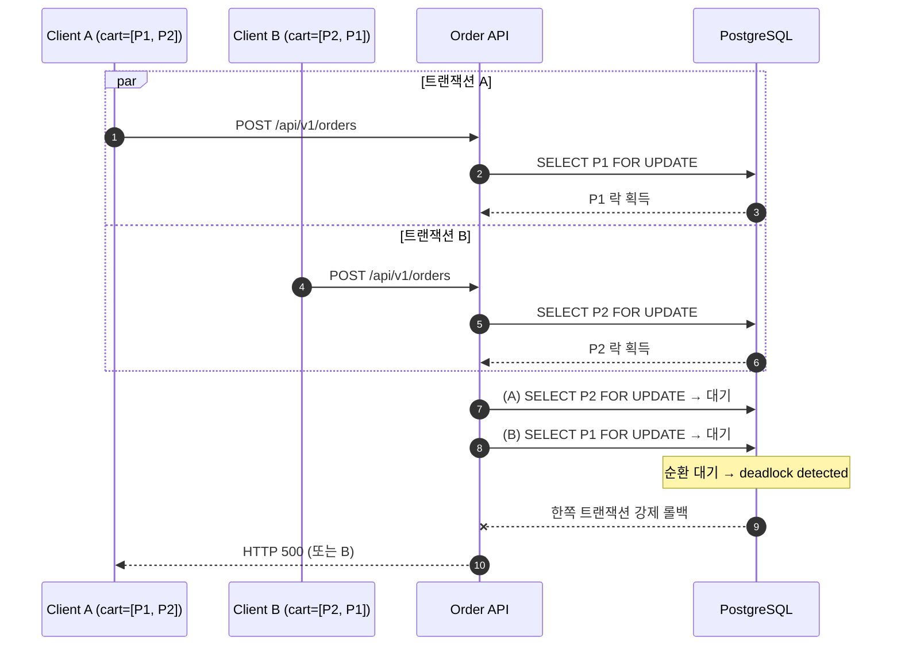

# 부하테스트 리포트

---

## 1. 시나리오 상세

| ID | 시나리오명 | 키워드 | 엔드포인트 | 목표 가설 | 가설 근거(코드) | 트래픽/패턴 | 예상 문제점 | 기술적 근거 |
|----|-----------|--------|-----------|----------|----------------|------------|------------|-------------|
| **ATK-A05** | 락 획득 순서 교차로 인한 데드락 유도 | `데드락` `락순서` | `POST /api/v1/orders` | 같은 상품 집합을 서로 다른 순서로 처리하는 주문이 동시 유입될 때 교차 락 획득으로 데드락이 발생할 수 있다. | `createOrder()`가 cart item 순서대로 `findByIdWithLock()` 수행<br>락 획득 전 `product.id` 기준 정렬 로직 없음 | 서로 다른 회원 카트에 동일 상품 집합을 역순으로 구성 후 동시 실행 / Spike | 데드락 발생, 트랜잭션 롤백, HTTP 500 사용자 노출 | 트랜잭션 A가 `상품1` 보유 중 `상품2` 대기, 트랜잭션 B가 `상품2` 보유 중 `상품1` 대기 → 순환 대기 조건 충족 → PostgreSQL `deadlock detected`. 재시도 로직 없어 에러 그대로 노출 |

---

## 2. 시퀀스 다이어그램 *(참고 예시 — 직접 다듬어 작성)*



---

## 3. 레이어별 분석

### 3-1. 애플리케이션

- **트랜잭션 범위**:
- **외부 의존성 영향**:
- **예외 처리 / 재시도 로직**:
- **코드 개선 포인트**:
- 추가 발견 이슈:

### 3-2. DB

- **락 경합 / 데드락**:
- **인덱스 / 쿼리 효율**:
- **커넥션 사용 패턴**:
- **데이터 정합성**:
- 추가 발견 이슈:

### 3-3. 인프라 & RabbitMQ

- **CPU / Memory / Disk I/O**:
- **네트워크 / 커넥션 풀**:
- **RabbitMQ** (해당 시):
- **인프라 개선 포인트**:
- 추가 발견 이슈:

---

## 4. 테스트 설계

**더미 데이터 요청**: 종류 / 수량 / 특이 조건

*(예: 회원 2명 이상, 동일 상품 집합 N개를 역순으로 담은 cart 다수, 동시 주문이 가능하도록 stock 충분)*

```javascript
// k6 스크립트 — 교차 락 순서로 주문 동시 실행
import http from 'k6/http';
import { check } from 'k6';

export const options = {
    scenarios: {
        // TODO: ATK-A05 — 두 그룹 VU가 각각 정순/역순 cart로 동시 주문 (Spike)
    },
};

export default function () {
    // TODO: POST /api/v1/orders 호출 (VU 그룹별 cartItemIds 순서 다르게)
}
```

---

## 5. 실행 결과 *(공격 당일 작성)*

| 시나리오 | TPS | p95 | 에러율 | 비고 |
|---------|-----|-----|------|------|
| ATK-A05 |     |     |       |      |

**Grafana 스크린샷**: TPS / 응답시간 / 에러율 / 자원사용량 (필요한 것만 첨부)

**예상 문제점 적중 여부**

- ATK-A05:

---

## 6. 종합 결론 & 방어팀 전달 *(공격 당일 작성)*

- **가설 적중**: ✅ / ❌ + 핵심 실측 한 줄
- **방어팀 전달**:
