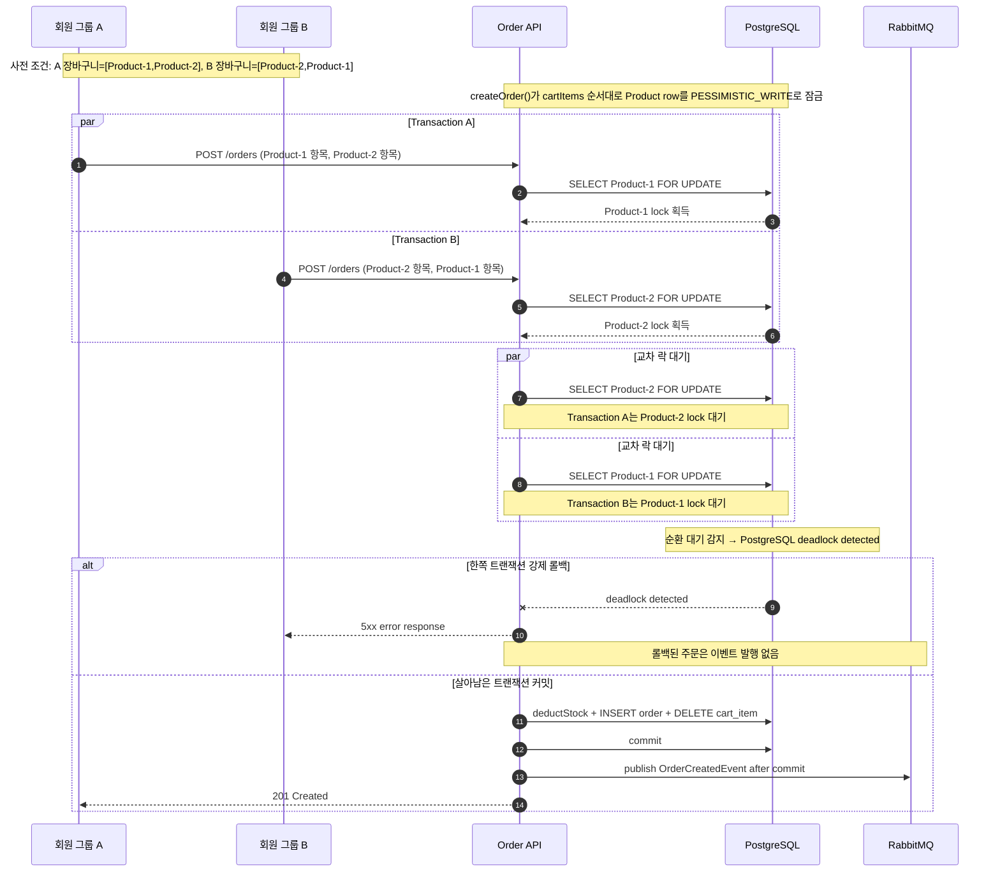

# 부하테스트 리포트
  
---  

## 1. 시나리오 상세

| ID          | 시나리오명                 | 키워드         | 엔드포인트                 | 목표 가설                                                          | 가설 근거(코드)                                                                                  | 트래픽/패턴                                         | 예상 문제점                           | 기술적 근거                                                                                                                       |
| ----------- | --------------------- | ----------- | --------------------- | -------------------------------------------------------------- | ------------------------------------------------------------------------------------------ | ---------------------------------------------- | -------------------------------- | ---------------------------------------------------------------------------------------------------------------------------- |
| **ATK-A05** | 락 획득 순서 교차로 인한 데드락 유도 | `데드락` `락순서` | `POST /api/v1/orders` | 같은 상품 집합을 서로 다른 순서로 처리하는 주문이 동시 유입될 때 교차 락 획득으로 데드락이 발생할 수 있다. | `createOrder()`가 cart item 순서대로 `findByIdWithLock()` 수행<br>락 획득 전 `product.id` 기준 정렬 로직 없음 | 서로 다른 회원 카트에 동일 상품 집합을 역순으로 구성 후 동시 실행 / Spike | 데드락 발생, 트랜잭션 롤백, HTTP 500 사용자 노출 | 트랜잭션 A가 `상품1` 보유 중 `상품2` 대기, 트랜잭션 B가 `상품2` 보유 중 `상품1` 대기 → 순환 대기 조건 충족 → PostgreSQL `deadlock detected`. 재시도 로직 없어 에러 그대로 노출 |
  
---  

## 2. 시퀀스 다이어그램


  
---  

## 3. 레이어별 분석

### 3-1. 애플리케이션

- **트랜잭션 범위**:
- **외부 의존성 영향**:
- **예외 처리 / 재시도 로직**:
- **코드 개선 포인트**:
- 추가 발견 이슈:

### 3-2. DB

- **락 경합 / 데드락**:
- **인덱스 / 쿼리 효율**:
- **커넥션 사용 패턴**:
- **데이터 정합성**:
- 추가 발견 이슈:

### 3-3. 인프라 & RabbitMQ

- **CPU / Memory / Disk I/O**:
    - CPU: 데드락 시점부터 CPU 사용률 상승
    - Memory: 데드락 시점부터 Tomcat worker Thread 모두 사용되어 스택 메모리 사용량 증가 예상
    - Disk I/O: 데드락 예외 로그로 쓰기 I/O 증가 예상
- **네트워크 / 커넥션 풀**:
    - 커넥션 풀: 데드락 발생 빈도가 높아 요청량 증가시 HikariCP active connection, pending connection, connection Timeout 지표 상승
- **RabbitMQ** (해당 시):
    - 정상 commit된 주문만 RabbitMQ로 `OrderCreatedEvent` 발행
    - 데드락으로 롤백된 트랜잭션으로 RabbitMq publish 처리량 감소 및 주문 성공률 감소
- **인프라 개선 포인트**:
    - PostgreSQL `deadlocks`, `lock wait`, `blocked session` 모니터링 알림 필요
    - HikariCP active/pending/timeout 지표 모니터링 필요
    - Tomcat busy thread, request queue, 5xx rate 모니터링 필요
    - RabbitMQ publish/consume rate, queue depth, DLQ 적재량 모니터링 필요
    - 데드락 확인 시 커넥션 풀 증설보다 product lock 획득 순서 정렬, 재시도 정책, 트랜잭션 범위 축소를 우선 검토
- 추가 발견 이슈:

---  

## 4. 테스트 설계

```javascript  
import http from 'k6/http';  
import { check } from 'k6';  
import { Counter, Trend } from 'k6/metrics';  
import exec from 'k6/execution';  
  
const BASE_URL = __ENV.BASE_URL || 'http://localhost:8080';  
const PRODUCT_A_ID = parseInt(__ENV.PRODUCT_A_ID || '1');  
const PRODUCT_B_ID = parseInt(__ENV.PRODUCT_B_ID || '2');  
const MEMBER_A_START = parseInt(__ENV.MEMBER_A_START || '1');  
const MEMBER_B_START = parseInt(__ENV.MEMBER_B_START || '2501');  
const MEMBER_COUNT_PER_GROUP = parseInt(__ENV.MEMBER_COUNT_PER_GROUP || '2500');  
const DURATION = __ENV.DURATION || 'short'; // short=1m / long=5m  
const TARGET_RPS = parseInt(__ENV.TARGET_RPS || '200');  
  
const deadlockErrors = new Counter('deadlock_errors');  
const lockErrors = new Counter('lock_errors');  
const cartFailures = new Counter('cart_failures');  
const orderSuccess = new Counter('order_success');  
const orderFailures = new Counter('order_failures');  
const orderDuration = new Trend('order_duration');  
  
const testDuration = DURATION === 'long' ? '5m' : '1m';  
const groupRate = Math.max(1, Math.floor(TARGET_RPS / 2));  
  
export const options = {  
    scenarios: {  
        order_p1_p2: {  
            executor: 'constant-arrival-rate',  
            exec: 'orderP1P2',  
            rate: groupRate,  
            timeUnit: '1s',  
            duration: testDuration,  
            preAllocatedVUs: 100,  
            maxVUs: 500,  
        },  
        order_p2_p1: {  
            executor: 'constant-arrival-rate',  
            exec: 'orderP2P1',  
            rate: groupRate,  
            timeUnit: '1s',  
            duration: testDuration,  
            preAllocatedVUs: 100,  
            maxVUs: 500,  
        },  
    },  
    thresholds: {  
        order_duration: ['p(95)<1000'],  
    },  
};  
  
export function orderP1P2() {  
    runOrderFlow(MEMBER_A_START, [PRODUCT_A_ID, PRODUCT_B_ID]);  
}  
  
export function orderP2P1() {  
    runOrderFlow(MEMBER_B_START, [PRODUCT_B_ID, PRODUCT_A_ID]);  
}  
  
function runOrderFlow(memberStart, productIds) {  
    const memberId = memberStart + (exec.scenario.iterationInTest % MEMBER_COUNT_PER_GROUP);  
    const headers = {  
        'Content-Type': 'application/json',  
        'X-Member-Id': String(memberId),  
    };  
  
    const cartItemIds = [];  
    for (const productId of productIds) {  
        const cartItemId = addCartItem(headers, productId);  
        if (!cartItemId) {  
            cartFailures.add(1);  
            return;  
        }  
        cartItemIds.push(cartItemId);  
    }  
  
    // cart item을 서로 반대 순서로 생성하고 같은 순서로 주문한다.  
    // 현재 repository query에 ORDER BY가 없어 DB 조회 결과 순서가 고정되지 않는 점도 함께 검증 대상이다.    const payload = JSON.stringify({ cartItemIds });  
    const startedAt = Date.now();  
    const res = http.post(`${BASE_URL}/api/v1/orders`, payload, { headers, timeout: '60s' });  
    orderDuration.add(Date.now() - startedAt);  
  
    if (res.status === 201) {  
        orderSuccess.add(1);  
    } else {  
        orderFailures.add(1);  
        classifyOrderError(res);  
    }  
  
    check(res, {  
        '응답 수신': (r) => r.status !== 0,  
        '주문 성공 또는 데드락 관측': (r) => r.status === 201 || isDeadlock(r),  
    });  
}  
  
function addCartItem(headers, productId) {  
    const res = http.post(  
        `${BASE_URL}/api/v1/cart/items`,  
        JSON.stringify({ productId, quantity: 1 }),  
        { headers, timeout: '30s' }  
    );  
  
    if (res.status !== 200 && res.status !== 201) {  
        return null;  
    }  
  
    try {  
        return JSON.parse(res.body).cartItemId || null;  
    } catch (e) {  
        return null;  
    }  
}  
  
function classifyOrderError(res) {  
    const body = (res.body || '').toLowerCase();  
    if (isDeadlock(res)) {  
        deadlockErrors.add(1);  
    } else if (body.includes('lock') || body.includes('pessimistic') || body.includes('timeout')) {  
        lockErrors.add(1);  
    }  
}  
  
function isDeadlock(res) {  
    const body = (res.body || '').toLowerCase();  
    return body.includes('deadlock') ||  
        body.includes('deadlockloserdataaccessexception') ||  
        body.includes('40p01');  
}
```  
  
---  

## 5. 실행 결과 *(공격 당일 작성)*

| 시나리오    | TPS(초당 트랜잭션 요청 수) | p95<br>(요청의 95% 처리시간) | 에러율<br>(실패 요청수/전체 요청 수) | 비고  |
| ------- | ----------------- | --------------------- | ----------------------- | --- |
| ATK-A05 |                   |                       |                         |     |

**Grafana 스크린샷**: TPS / 응답시간 / 에러율 / 자원사용량 (필요한 것만 첨부)

**예상 문제점 적중 여부**

- ATK-A05:

---  

## 6. 종합 결론 & 방어팀 전달 *(공격 당일 작성)*

- **가설 적중**: ✅ / ❌ + 핵심 실측 한 줄
- **방어팀 전달**:
