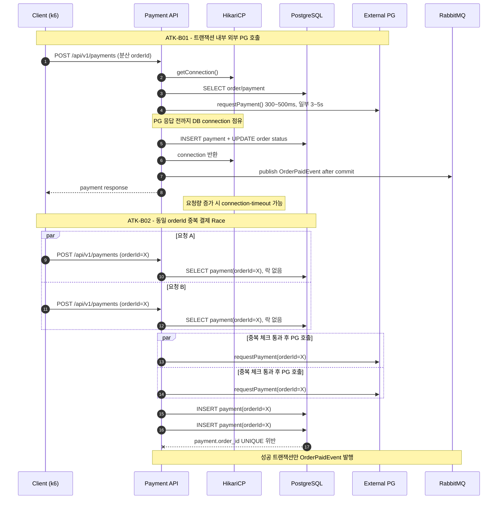

# 부하테스트 리포트
  
---  

## 1. 시나리오 상세

| ID          | 시나리오명                      | 키워드                    | 엔드포인트                   | 목표 가설                                                                        | 가설 근거(코드)                                                                                                                                                         | 트래픽/패턴                                   | 예상 문제점                                       | 기술적 근거                                                                                                                   |
| ----------- | -------------------------- | ---------------------- | ----------------------- | ---------------------------------------------------------------------------- | ----------------------------------------------------------------------------------------------------------------------------------------------------------------- | ---------------------------------------- | -------------------------------------------- | ------------------------------------------------------------------------------------------------------------------------ |
| **ATK-B01** | 외부 PG 트랜잭션 점유로 인한 커넥션 풀 고갈 | `외부의존성` `리소스소진` `커넥션풀` | `POST /api/v1/payments` | 외부 PG 호출이 트랜잭션 내부에 존재해 평균 약 472ms 동안 커넥션을 점유하며, 21 TPS를 넘는 순간 풀이 고갈된다.       | `PaymentService.requestPayment()`가 `@Transactional` 메서드 내부에서 `ExternalPaymentClient.requestPayment()` 호출<br>2% 확률로 `Thread.sleep(3000~5000)` 분기 존재                | 10 → 30 → 60 → 100 VU / Stepped, 10분     | 결제 지연 급증, connection timeout, 타 API 응답 전파 지연 | HikariCP max=10, PG 평균 ≈ `0.98×400ms + 0.02×4000ms ≈ 472ms` → 이론 한계 ≈ `10 / 0.472 ≈ 21 TPS`. 초과 시 신규 요청 30s timeout 후 실패 |
| **ATK-B02** | 중복 결제 Race Condition       | `동시성` `정합성` `락 누락`     | `POST /api/v1/payments` | 동일 `orderId` 결제 요청이 동시에 들어오면 락 없는 중복 체크와 저장 사이 race window로 이중 결제가 발생할 수 있다. | `PaymentService.requestPayment()`의 중복 체크가 `paymentRepository.findByOrderIdAndStatusNot(orderId, FAILED)` — **락 없는 일반 SELECT**<br>이후 `paymentRepository.save()` 수행 | 동일 `orderId`에 동시 2~10 요청 × 100세트 / Spike | 이중 결제 시도·외부 PG 이중 호출, 409/500 혼재, 결제 상태 불안정  | 락 없는 중복 체크 → 두 트랜잭션이 동시에 SELECT 통과 후 INSERT 진행. `payment.order_id` UNIQUE 제약과 조회-저장 시간차가 결합해 race window 발생              |
  
---  

## 2. 시퀀스 다이어그램


  
---  

## 3. 레이어별 분석

### 3-1. 애플리케이션

- **트랜잭션 범위**:
- **외부 의존성 영향**:
- **예외 처리 / 재시도 로직**:
- **코드 개선 포인트**:
- 추가 발견 이슈:

### 3-2. DB

- **락 경합 / 데드락**:
- **인덱스 / 쿼리 효율**:
- **커넥션 사용 패턴**:
- **데이터 정합성**:
- 추가 발견 이슈:

### 3-3. 인프라 & RabbitMQ

- **CPU / Memory / Disk I/O**:
    - CPU: 외부 PG 지연, connection timeout, 중복 결제 예외 처리량 증가로 WAS CPU 사용률 상승 예상
    - Disk I/O: `SQLTransientConnectionException`, `DUPLICATE_REQUEST`, `payment.order_id` UNIQUE 위반, 외부 PG 실패 로그 반복 출력 시 로그 쓰기 I/O 증가 예상
    - Memory: PG 응답 대기 중 Tomcat worker thread와 트랜잭션 컨텍스트가 유지되어 동시 요청 증가 시 스택 메모리 사용량 증가 가능
- **네트워크 / 커넥션 풀**:
    - `PaymentService.requestPayment()`가 `@Transactional` 내부에서 외부 PG를 호출하므로 PG 응답 대기 시간 동안 DB connection을 점유
    - HikariCP max pool size 10 기준, PG 응답 지연이 누적되면 active connection과 pending connection이 증가하고 connection timeout 발생 가능
    - 결제 API가 connection을 오래 점유하면 주문/조회/취소 등 다른 API의 DB connection 획득 지연으로 전파될 수 있음
- **RabbitMQ** (해당 시):
    - 정상 commit된 결제만 RabbitMQ로 `OrderPaidEvent` 발행
    - 외부 PG 실패로 주문이 자동 취소되는 경우 `OrderCancelledEvent`가 발행될 수 있음
    - connection timeout 또는 DB unique 제약 위반으로 트랜잭션이 롤백되면 해당 요청은 이벤트 발행 단계에 도달하지 못함
    - 장애 구간의 RabbitMQ publish 처리량은 결제 성공률과 자동 취소 건수 모두 트랜잭션 요청에 비해 작을 것으로 예상
- **인프라 개선 포인트**:
    - HikariCP active/pending/timeout 지표 모니터링 알림 필요
    - Tomcat busy thread, request queue, 5xx rate 모니터링 필요
    - 외부 PG 응답 시간, timeout rate, failure rate 지표 분리 필요
    - RabbitMQ publish/consume rate, queue depth, DLQ 적재량 모니터링 필요
    - 커넥션 풀 증설보다 외부 PG 호출을 트랜잭션 밖으로 분리하거나 결제 요청을 비동기/아웃박스 패턴으로 전환하는 방안 우선 검토
- 추가 발견 이슈:

---  

## 4. 테스트 설계

```javascript  
import http from 'k6/http';  
import { check } from 'k6';  
import { Counter, Trend } from 'k6/metrics';  
import exec from 'k6/execution';  
  
const BASE_URL = __ENV.BASE_URL || 'http://localhost:8080';  
const MODE = __ENV.MODE || 'b01'; // b01 | b02 | both  
  
const B01_ORDER_START = parseInt(__ENV.B01_ORDER_START || '1');  
const B01_ORDER_COUNT = parseInt(__ENV.B01_ORDER_COUNT || '3000');  
const B02_ORDER_ID = parseInt(__ENV.B02_ORDER_ID || '3900');  
const B02_MEMBER_ID = parseInt(__ENV.B02_MEMBER_ID || String(B02_ORDER_ID));  
  
const DURATION = __ENV.DURATION || 'short'; // short=1m / long=10m  
  
const paymentSuccess = new Counter('payment_success');  
const paymentFailures = new Counter('payment_failures');  
const duplicateErrors = new Counter('duplicate_errors');  
const invalidStatusErrors = new Counter('invalid_status_errors');  
const connectionTimeouts = new Counter('connection_timeout_errors');  
const pgFailures = new Counter('pg_failures');  
const uniqueViolations = new Counter('unique_violation_errors');  
const paymentDuration = new Trend('payment_duration');  
  
const b01Stages = DURATION === 'long'  
    ? [  
        { duration: '2m', target: 10 },  
        { duration: '2m', target: 30 },  
        { duration: '2m', target: 60 },  
        { duration: '2m', target: 100 },  
        { duration: '2m', target: 0 },  
    ]  
    : [  
        { duration: '10s', target: 10 },  
        { duration: '10s', target: 30 },  
        { duration: '15s', target: 60 },  
        { duration: '15s', target: 100 },  
        { duration: '10s', target: 0 },  
    ];  
  
const scenarios = {};  
  
if (MODE === 'b01' || MODE === 'both') {  
    scenarios.b01_distributed_payments = {  
        executor: 'ramping-vus',  
        exec: 'b01DistributedPayments',  
        startVUs: 0,  
        stages: b01Stages,  
        gracefulRampDown: '10s',  
    };  
}  
  
if (MODE === 'b02' || MODE === 'both') {  
    scenarios.b02_duplicate_payment_race = {  
        executor: 'shared-iterations',  
        exec: 'b02DuplicatePaymentRace',  
        vus: parseInt(__ENV.B02_VUS || '20'),  
        iterations: parseInt(__ENV.B02_ITERATIONS || '100'),  
        maxDuration: __ENV.B02_MAX_DURATION || '1m',  
    };  
}  
  
export const options = {  
    scenarios,  
    thresholds: {  
        payment_duration: ['p(95)<3000'],  
    },  
};  
  
export function b01DistributedPayments() {  
    const offset = exec.scenario.iterationInTest % B01_ORDER_COUNT;  
    const orderId = B01_ORDER_START + offset;  
    requestPayment(orderId, orderId);  
}  
  
export function b02DuplicatePaymentRace() {  
    requestPayment(B02_MEMBER_ID, B02_ORDER_ID);  
}  
  
function requestPayment(memberId, orderId) {  
    const headers = {  
        'Content-Type': 'application/json',  
        'X-Member-Id': String(memberId),  
    };  
  
    const startedAt = Date.now();  
    const res = http.post(  
        `${BASE_URL}/api/v1/payments`,  
        JSON.stringify({ orderId }),  
        { headers, timeout: '60s' }  
    );  
    paymentDuration.add(Date.now() - startedAt);  
  
    if (res.status === 200) {  
        paymentSuccess.add(1);  
    } else {  
        paymentFailures.add(1);  
        classifyPaymentError(res);  
    }  
  
    check(res, {  
        '응답 수신': (r) => r.status !== 0,  
        '결제 성공 또는 예상 실패': (r) => r.status === 200 || isExpectedFailure(r),  
    });  
}  
  
function classifyPaymentError(res) {  
    const body = (res.body || '').toLowerCase();  
    if (body.includes('duplicate_request') || body.includes('중복') || res.status === 409) {  
        duplicateErrors.add(1);  
    }  
    if (body.includes('invalid_order_status') || body.includes('결제 대기 상태')) {  
        invalidStatusErrors.add(1);  
    }  
    if (body.includes('connection') || body.includes('hikari') || body.includes('sqltransientconnection')) {  
        connectionTimeouts.add(1);  
    }  
    if (body.includes('payment_failed') || body.includes('외부 결제')) {  
        pgFailures.add(1);  
    }  
    if (body.includes('unique') || body.includes('constraint') || body.includes('duplicate key')) {  
        uniqueViolations.add(1);  
    }  
}  
  
function isExpectedFailure(res) {  
    const body = (res.body || '').toLowerCase();  
    return res.status === 409 ||  
        body.includes('duplicate_request') ||  
        body.includes('invalid_order_status') ||  
        body.includes('결제 대기 상태') ||  
        body.includes('payment_failed') ||  
        body.includes('connection') ||  
        body.includes('hikari') ||  
        body.includes('unique') ||  
        body.includes('constraint') ||  
        body.includes('duplicate key');  
}
```  
  
---  

## 5. 실행 결과 *(공격 당일 작성)*

| 시나리오    | TPS(초당 트랜잭션 요청 수) | p95<br>(요청의 95% 처리시간) | 에러율<br>(실패 요청수/전체 요청 수) | 비고  |     |
| ------- | ----------------- | --------------------- | ----------------------- | --- | --- |
| ATK-B01 |                   |                       |                         |     |     |
| ATK-B02 |                   |                       |                         |     |     |

**Grafana 스크린샷**: TPS / 응답시간 / 에러율 / 자원사용량 (필요한 것만 첨부)

**예상 문제점 적중 여부**

- ATK-B01:
- ATK-B02:

---  

## 6. 종합 결론 & 방어팀 전달 *(공격 당일 작성)*

- **가설 적중**: ✅ / ❌ + 핵심 실측 한 줄
- **방어팀 전달**:
