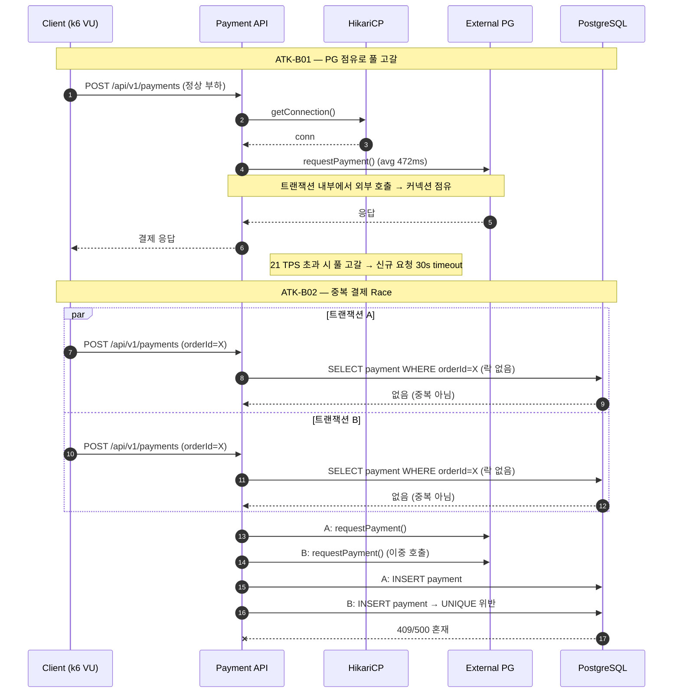

# 부하테스트 리포트

---

## 1. 시나리오 상세

| ID | 시나리오명 | 키워드 | 엔드포인트 | 목표 가설 | 가설 근거(코드) | 트래픽/패턴 | 예상 문제점 | 기술적 근거 |
|----|-----------|--------|-----------|----------|----------------|------------|------------|-------------|
| **ATK-B01** | 외부 PG 트랜잭션 점유로 인한 커넥션 풀 고갈 | `외부의존성` `리소스소진` `커넥션풀` | `POST /api/v1/payments` | 외부 PG 호출이 트랜잭션 내부에 존재해 평균 약 472ms 동안 커넥션을 점유하며, 21 TPS를 넘는 순간 풀이 고갈된다. | `PaymentService.requestPayment()`가 `@Transactional` 메서드 내부에서 `ExternalPaymentClient.requestPayment()` 호출<br>2% 확률로 `Thread.sleep(3000~5000)` 분기 존재 | 10 → 30 → 60 → 100 VU / Stepped, 10분 | 결제 지연 급증, connection timeout, 타 API 응답 전파 지연 | HikariCP max=10, PG 평균 ≈ `0.98×400ms + 0.02×4000ms ≈ 472ms` → 이론 한계 ≈ `10 / 0.472 ≈ 21 TPS`. 초과 시 신규 요청 30s timeout 후 실패 |
| **ATK-B02** | 중복 결제 Race Condition | `동시성` `정합성` `락 누락` | `POST /api/v1/payments` | 동일 `orderId` 결제 요청이 동시에 들어오면 락 없는 중복 체크와 저장 사이 race window로 이중 결제가 발생할 수 있다. | `PaymentService.requestPayment()`의 중복 체크가 `paymentRepository.findByOrderIdAndStatusNot(orderId, FAILED)` — **락 없는 일반 SELECT**<br>이후 `paymentRepository.save()` 수행 | 동일 `orderId`에 동시 2~10 요청 × 100세트 / Spike | 이중 결제 시도·외부 PG 이중 호출, 409/500 혼재, 결제 상태 불안정 | 락 없는 중복 체크 → 두 트랜잭션이 동시에 SELECT 통과 후 INSERT 진행. `payment.order_id` UNIQUE 제약과 조회-저장 시간차가 결합해 race window 발생 |

---

## 2. 시퀀스 다이어그램 *(참고 예시 — 직접 다듬어 작성)*



---

## 3. 레이어별 분석

### 3-1. 애플리케이션

- **트랜잭션 범위**:
- **외부 의존성 영향**:
- **예외 처리 / 재시도 로직**:
- **코드 개선 포인트**:
- 추가 발견 이슈:

### 3-2. DB

- **락 경합 / 데드락**:
- **인덱스 / 쿼리 효율**:
- **커넥션 사용 패턴**:
- **데이터 정합성**:
- 추가 발견 이슈:

### 3-3. 인프라 & RabbitMQ

- **CPU / Memory / Disk I/O**:
- **네트워크 / 커넥션 풀**:
- **RabbitMQ** (해당 시):
- **인프라 개선 포인트**:
- 추가 발견 이슈:

---

## 4. 테스트 설계

**더미 데이터 요청**: 종류 / 수량 / 특이 조건

*(예: B01은 다양한 orderId 분산 부하 / B02는 동일 orderId에 대해 동시 다중 요청 가능한 시나리오, 결제 가능한 PENDING 주문 다수)*

```javascript
// k6 스크립트 — B01 (Stepped 부하) + B02 (동일 orderId Spike)
import http from 'k6/http';
import { check } from 'k6';

export const options = {
    scenarios: {
        // TODO: ATK-B01 — 분산 orderId, 10 → 30 → 60 → 100 VU Stepped 10분
        // TODO: ATK-B02 — 동일 orderId에 동시 2~10 요청 × 100세트 (Spike)
    },
};

export default function () {
    // TODO: POST /api/v1/payments 호출
}
```

---

## 5. 실행 결과 *(공격 당일 작성)*

| 시나리오 | TPS | p95 | 에러율 | 비고 |
|---------|-----|-----|------|------|
| ATK-B01 |     |     |       |      |
| ATK-B02 |     |     |       |      |

**Grafana 스크린샷**: TPS / 응답시간 / 에러율 / 자원사용량 (필요한 것만 첨부)

**예상 문제점 적중 여부**

- ATK-B01:
- ATK-B02:

---

## 6. 종합 결론 & 방어팀 전달 *(공격 당일 작성)*

- **가설 적중**: ✅ / ❌ + 핵심 실측 한 줄
- **방어팀 전달**:
