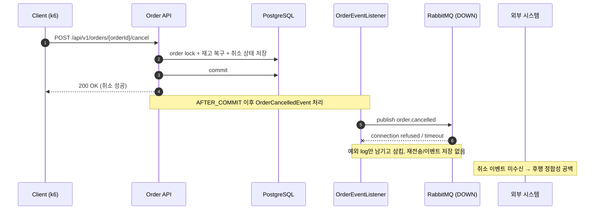

# 부하테스트 리포트
  
---  

## 1. 시나리오 상세

| ID | 시나리오명 | 키워드 | 엔드포인트 | 목표 가설 | 가설 근거(코드) | 트래픽/패턴 | 예상 문제점 | 기술적 근거 |  
|----|-----------|--------|-----------|----------|----------------|------------|------------|-------------|  
| **ATK-C03** | 취소 이벤트 발행 실패에 따른 후행 정합성 공백 | `메시지유실` `정합성` | `POST /api/v1/orders/{orderId}/cancel` | 주문 취소·재고 복구는 DB에 커밋되지만, 커밋 이후 RabbitMQ 발행이 실패하면 외부 시스템은 취소 사실을 받지 못할 수 있다. | `cancelOrder()`에서 이벤트 발행<br>`OrderEventListener`는 `@TransactionalEventListener(phase = AFTER_COMMIT)` 적용<br>`RabbitMQEventPublisher.publishOrderCancelled()`는 예외 발생 시 로그만 남기고 삼킴 (재전송·이벤트 저장 없음) | RabbitMQ unavailable 상태에서 취소 요청 반복 실행 / Constant | 취소 성공 응답 ↔ 외부 시스템 미인지 불일치, 외부 보상 트랜잭션·알림 누락, 운영 가시성 공백 | DB 커밋 후 이벤트 발행 실패는 롤백 불가. 발행 실패 이벤트를 저장하거나 다시 보내는 장치가 없어 유실 가능. 예외 삼킴으로 운영자 조기 인지 불가 |  
  
---  

## 2. 시퀀스 다이어그램


  
---  

## 3. 레이어별 분석

### 3-1. 애플리케이션

- **트랜잭션 범위**:
- **외부 의존성 영향**:
- **예외 처리 / 재시도 로직**:
- **코드 개선 포인트**:
- 추가 발견 이슈:

### 3-2. DB

- **락 경합 / 데드락**:
- **인덱스 / 쿼리 효율**:
- **커넥션 사용 패턴**:
- **데이터 정합성**:
- 추가 발견 이슈:

### 3-3. 인프라 & RabbitMQ

- **CPU / Memory / Disk I/O**:
    - CPU: RabbitMQ publish 실패 예외 처리와 반복 로그 출력으로 WAS CPU 사용률 상승 예상
    - Disk I/O: `Failed to publish OrderCancelledEvent`, connection refused, timeout 로그가 반복 출력되면 로그 쓰기 I/O 증가 예상
    - Memory: RabbitMQ 연결 실패 자체는 장시간 트랜잭션 대기를 만들지 않지만, 취소 요청량이 많으면 Tomcat worker thread와 이벤트 처리 객체 생성량 증가 가능
- **네트워크 / 커넥션 풀**:
    - DB 변경은 먼저 commit되며, RabbitMQ 발행은 `AFTER_COMMIT` 이후 수행되므로 MQ 장애가 DB 트랜잭션 롤백으로 이어지지 않음
    - RabbitMQ 연결 실패가 길어지면 publish 호출 지연으로 취소 API 응답 시간이 증가할 수 있음
    - DB connection은 commit 시점에 반환되므로 ATK-A03처럼 DB connection pool exhaustion으로 직접 확산될 가능성은 낮음
- **RabbitMQ** (해당 시):
    - RabbitMQ unavailable 상태에서는 `OrderCancelledEvent` publish 실패 가능
    - publish 실패 예외를 `RabbitMQEventPublisher.publishOrderCancelled()`에서 catch 후 로그만 남기므로 API 응답은 성공으로 유지될 수 있음
    - DB에는 주문 취소와 재고 복구가 반영되지만 외부 시스템은 취소 이벤트를 받지 못해 후행 정합성 공백 발생 가능
    - RabbitMQ 발행에 실패한 취소 이벤트를 저장하거나 다시 보내는 장치가 없어 이벤트가 그대로 유실될 수 있음
- **인프라 개선 포인트**:
    - RabbitMQ publish failure rate, connection failure, channel error 모니터링 알림 필요
    - RabbitMQ publish/consume rate, queue depth, DLQ 적재량 모니터링 필요
    - 취소 API 성공 수와 `OrderCancelledEvent` publish 성공 수를 비교하는 정합성 지표 필요
    - RabbitMQ 발행 실패 시 이벤트를 저장해두는 테이블과 재전송 로직 도입 검토 필요
- 추가 발견 이슈:
    - `publishOrderCancelled()`가 예외를 삼켜 API 성공과 이벤트 발행 실패가 분리됨
    - DB commit 이후 publish 실패는 롤백할 수 없어 외부 시스템 미인지 상태가 발생 가능
    - 발행 실패 이벤트를 따로 저장하지 않아 운영자가 로그를 놓치면 어떤 취소 이벤트가 누락됐는지 사후 복구하기 어려움

---  

## 4. 테스트 설계
#### RabbitMQ 중단
```bash
# 테스트 전
docker stop pms-order-bteam-rabbitmq-1

# 테스트 후
docker start pms-order-bteam-rabbitmq-1
```

```javascript  
import http from 'k6/http';  
import { check } from 'k6';  
import { Counter, Trend } from 'k6/metrics';  
import exec from 'k6/execution';  
  
const BASE_URL = __ENV.BASE_URL || 'http://localhost:8080';  
const MODE = __ENV.MODE || 'b01'; // b01 | b02 | both  
  
const B01_ORDER_START = parseInt(__ENV.B01_ORDER_START || '1');  
const B01_ORDER_COUNT = parseInt(__ENV.B01_ORDER_COUNT || '3000');  
const B02_ORDER_ID = parseInt(__ENV.B02_ORDER_ID || '3900');  
const B02_MEMBER_ID = parseInt(__ENV.B02_MEMBER_ID || String(B02_ORDER_ID));  
  
const DURATION = __ENV.DURATION || 'short'; // short=1m / long=10m  
  
const paymentSuccess = new Counter('payment_success');  
const paymentFailures = new Counter('payment_failures');  
const duplicateErrors = new Counter('duplicate_errors');  
const invalidStatusErrors = new Counter('invalid_status_errors');  
const connectionTimeouts = new Counter('connection_timeout_errors');  
const pgFailures = new Counter('pg_failures');  
const uniqueViolations = new Counter('unique_violation_errors');  
const paymentDuration = new Trend('payment_duration');  
  
const b01Stages = DURATION === 'long'  
    ? [  
        { duration: '2m', target: 10 },  
        { duration: '2m', target: 30 },  
        { duration: '2m', target: 60 },  
        { duration: '2m', target: 100 },  
        { duration: '2m', target: 0 },  
    ]  
    : [  
        { duration: '10s', target: 10 },  
        { duration: '10s', target: 30 },  
        { duration: '15s', target: 60 },  
        { duration: '15s', target: 100 },  
        { duration: '10s', target: 0 },  
    ];  
  
const scenarios = {};  
  
if (MODE === 'b01' || MODE === 'both') {  
    scenarios.b01_distributed_payments = {  
        executor: 'ramping-vus',  
        exec: 'b01DistributedPayments',  
        startVUs: 0,  
        stages: b01Stages,  
        gracefulRampDown: '10s',  
    };  
}  
  
if (MODE === 'b02' || MODE === 'both') {  
    scenarios.b02_duplicate_payment_race = {  
        executor: 'shared-iterations',  
        exec: 'b02DuplicatePaymentRace',  
        vus: parseInt(__ENV.B02_VUS || '20'),  
        iterations: parseInt(__ENV.B02_ITERATIONS || '100'),  
        maxDuration: __ENV.B02_MAX_DURATION || '1m',  
    };  
}  
  
export const options = {  
    scenarios,  
    thresholds: {  
        payment_duration: ['p(95)<3000'],  
    },  
};  
  
export function b01DistributedPayments() {  
    const offset = exec.scenario.iterationInTest % B01_ORDER_COUNT;  
    const orderId = B01_ORDER_START + offset;  
    requestPayment(orderId, orderId);  
}  
  
export function b02DuplicatePaymentRace() {  
    requestPayment(B02_MEMBER_ID, B02_ORDER_ID);  
}  
  
function requestPayment(memberId, orderId) {  
    const headers = {  
        'Content-Type': 'application/json',  
        'X-Member-Id': String(memberId),  
    };  
  
    const startedAt = Date.now();  
    const res = http.post(  
        `${BASE_URL}/api/v1/payments`,  
        JSON.stringify({ orderId }),  
        { headers, timeout: '60s' }  
    );  
    paymentDuration.add(Date.now() - startedAt);  
  
    if (res.status === 200) {  
        paymentSuccess.add(1);  
    } else {  
        paymentFailures.add(1);  
        classifyPaymentError(res);  
    }  
  
    check(res, {  
        '응답 수신': (r) => r.status !== 0,  
        '결제 성공 또는 예상 실패': (r) => r.status === 200 || isExpectedFailure(r),  
    });  
}  
  
function classifyPaymentError(res) {  
    const body = (res.body || '').toLowerCase();  
    if (body.includes('duplicate_request') || body.includes('중복') || res.status === 409) {  
        duplicateErrors.add(1);  
    }  
    if (body.includes('invalid_order_status') || body.includes('결제 대기 상태')) {  
        invalidStatusErrors.add(1);  
    }  
    if (body.includes('connection') || body.includes('hikari') || body.includes('sqltransientconnection')) {  
        connectionTimeouts.add(1);  
    }  
    if (body.includes('payment_failed') || body.includes('외부 결제')) {  
        pgFailures.add(1);  
    }  
    if (body.includes('unique') || body.includes('constraint') || body.includes('duplicate key')) {  
        uniqueViolations.add(1);  
    }  
}  
  
function isExpectedFailure(res) {  
    const body = (res.body || '').toLowerCase();  
    return res.status === 409 ||  
        body.includes('duplicate_request') ||  
        body.includes('invalid_order_status') ||  
        body.includes('결제 대기 상태') ||  
        body.includes('payment_failed') ||  
        body.includes('connection') ||  
        body.includes('hikari') ||  
        body.includes('unique') ||  
        body.includes('constraint') ||  
        body.includes('duplicate key');  
}
```  
  
---  

## 5. 실행 결과 *(공격 당일 작성)*

| 시나리오    | TPS(초당 트랜잭션 요청 수) | p95<br>(요청의 95% 처리시간) | 에러율<br>(실패 요청수/전체 요청 수) | 비고  |     |
| ------- | ----------------- | --------------------- | ----------------------- | --- | --- |
| ATK-C03 |                   |                       |                         |     |     |

**Grafana 스크린샷**: TPS / 응답시간 / 에러율 / 자원사용량 (필요한 것만 첨부)

**예상 문제점 적중 여부**

- ATK-C03:

---  

## 6. 종합 결론 & 방어팀 전달 *(공격 당일 작성)*

- **가설 적중**: ✅ / ❌ + 핵심 실측 한 줄
- **방어팀 전달**:
