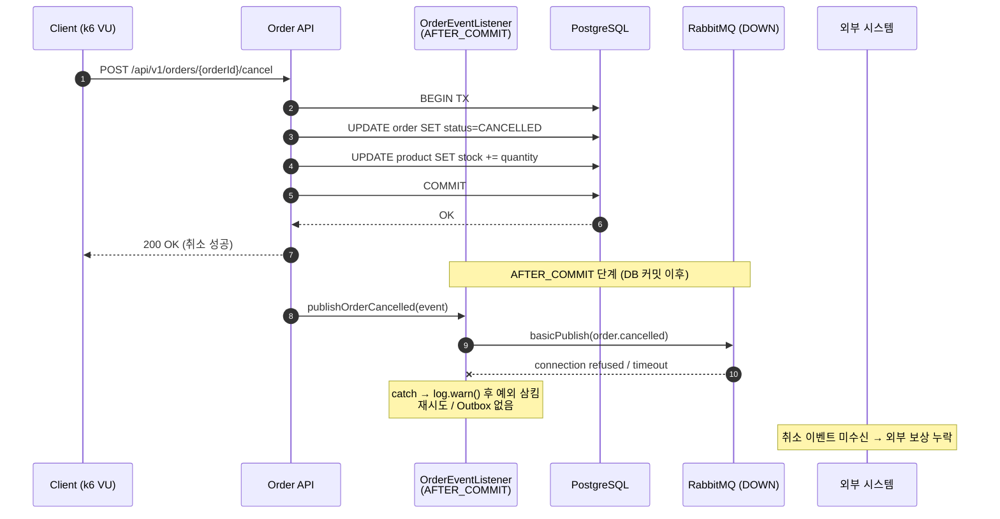

# 부하테스트 리포트

---

## 1. 시나리오 상세

| ID | 시나리오명 | 키워드 | 엔드포인트 | 목표 가설 | 가설 근거(코드) | 트래픽/패턴 | 예상 문제점 | 기술적 근거 |
|----|-----------|--------|-----------|----------|----------------|------------|------------|-------------|
| **ATK-C03** | 취소 이벤트 발행 실패에 따른 후행 정합성 공백 | `메시지유실` `정합성` | `POST /api/v1/orders/{orderId}/cancel` | 주문 취소·재고 복구는 DB에 커밋되지만, 커밋 이후 RabbitMQ 발행이 실패하면 외부 시스템은 취소 사실을 받지 못할 수 있다. | `cancelOrder()`에서 이벤트 발행<br>`OrderEventListener`는 `@TransactionalEventListener(phase = AFTER_COMMIT)` 적용<br>`RabbitMQEventPublisher.publishOrderCancelled()`는 예외 발생 시 로그만 남기고 삼킴 (재시도·Outbox 없음) | RabbitMQ unavailable 상태에서 취소 요청 반복 실행 / Constant | 취소 성공 응답 ↔ 외부 시스템 미인지 불일치, 외부 보상 트랜잭션·알림 누락, 운영 가시성 공백 | DB 커밋 후 이벤트 발행 실패는 롤백 불가. Outbox 패턴 미적용으로 유실 창이 상시 열려 있음. 예외 삼킴으로 운영자 조기 인지 불가 |

---

## 2. 시퀀스 다이어그램 *(참고 예시 — 직접 다듬어 작성)*



---

## 3. 레이어별 분석

### 3-1. 애플리케이션

- **트랜잭션 범위**:
- **외부 의존성 영향**:
- **예외 처리 / 재시도 로직**:
- **코드 개선 포인트**:
- 추가 발견 이슈:

### 3-2. DB

- **락 경합 / 데드락**:
- **인덱스 / 쿼리 효율**:
- **커넥션 사용 패턴**:
- **데이터 정합성**:
- 추가 발견 이슈:

### 3-3. 인프라 & RabbitMQ

- **CPU / Memory / Disk I/O**:
- **네트워크 / 커넥션 풀**:
- **RabbitMQ** (해당 시):
- **인프라 개선 포인트**:
- 추가 발견 이슈:

---

## 4. 테스트 설계

**더미 데이터 요청**: 종류 / 수량 / 특이 조건

*(예: 취소 가능한 PENDING 주문 다수, 사전에 RabbitMQ 컨테이너 stop / 네트워크 차단 상태로 unavailable 재현)*

```javascript
// k6 스크립트 — RabbitMQ unavailable 상태에서 취소 요청 반복
import http from 'k6/http';
import { check } from 'k6';

export const options = {
    scenarios: {
        // TODO: ATK-C03 — Constant arrival rate (RabbitMQ down 환경에서 cancel 호출)
    },
};

export default function () {
    // TODO: POST /api/v1/orders/{orderId}/cancel 호출
}
```

---

## 5. 실행 결과 *(공격 당일 작성)*

| 시나리오 | TPS | p95 | 에러율 | 비고 |
|---------|-----|-----|------|------|
| ATK-C03 |     |     |       |      |

**Grafana 스크린샷**: TPS / 응답시간 / 에러율 / 자원사용량 (필요한 것만 첨부)

**예상 문제점 적중 여부**

- ATK-C03:

---

## 6. 종합 결론 & 방어팀 전달 *(공격 당일 작성)*

- **가설 적중**: ✅ / ❌ + 핵심 실측 한 줄
- **방어팀 전달**:
